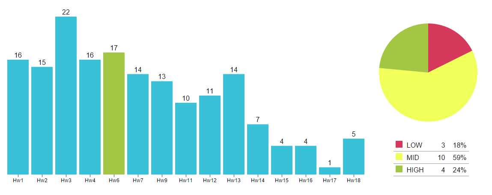

# Front-End Visualization: D3.js Charts

> Constructing D3 charts application according to the [Home Assignment] (https://kb.epam.com/display/GDOKB/Lecture19%3A+D3.js+library)



### System requirements:
- Node.js -v 4.0.0
- NPM -v 2.14.2

### Dependencies installation:
```sh
$ npm install -g bower
$ npm install -g http-server
```

### Running application:
```sh
$ git clone [git-repo-url] js_mentoring_kyiv_2015
$ cd js_mentoring_kyiv_2015/Module7/Hw19/d3-charts
$ bower install
$ http-server -p 3000
```
> [http://localhost:3000/](http://localhost:3000/)

### Application advantages:
- Modular file structure
- Modular code structure
- BEM layout structure
- jQuery code style
- High level UX

### Implemented features:
- EPAM [visual guidelines](https://elements.epam.com/visual-guidelines) recommendations are in place
- Toggle component to choose between `EASY` and `CUTE` chart
- Transitions for changing states
- Dynamic data with students grades
- Statistics from the beginning of time
- Pie layout and bar chart work together

### Check list:
- Start the server on 3000 port and open browser
- Choose between `EASY` and `CUTE` charts
- Low, Mid and High names corresponds to 2, 3 and 4 marks
- Enjoy with `EASY` and have fun with `CUTE` one

